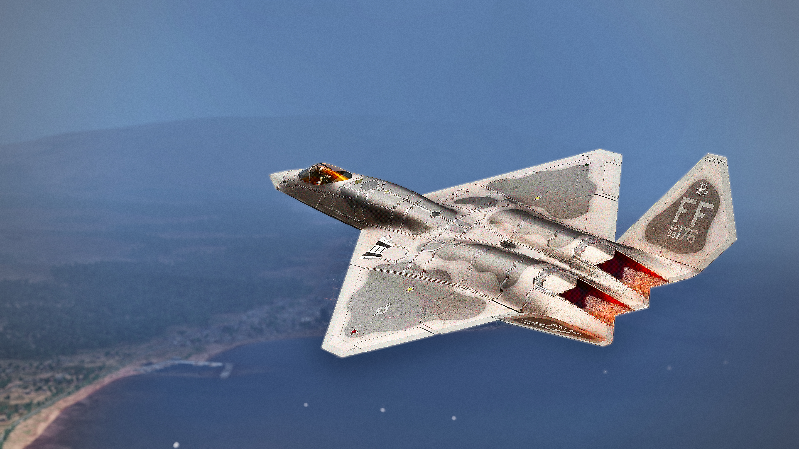

# ThunderStruck Simulations F-23A Mod for DCS World
 TODO: Change to the actual public repo.   

Hello and welcome to you whoever you are! This is the GitHub repository of the F-23A mod for DCS World. To download the latest release of the mod click [here (TODO: Change to the release link)](https://google.com).

**NOTE:** The F-15C Flaming Cliffs (included in DCS: Flaming Cliffs 2024) DLC is needed for this mod to work. You will also need to load the F-15C cockpit once per game start to be able to load the F-23A cockpit (this is an unfixable* bug by ED).

*[This](https://forum.dcs.world/topic/355315-global-fix-for-all-fc3-dependent-mods) fixes the problem but breaks IC.

## Credits:

* Brad Fischer "Smash" - Lead Developer and code 
* Mr. Benevolent Canard – Display Lead and code 
* Spurts – Flight Model lead 
* Nuffbutter – Artist and Liveries 
* Jeppef - Photography 
* Lukainaudi – Rearming Screen Art and UFCD design assistance 
* ziggysweet_soul_dust – UFCD loading Screen desig
#### Special Thanks to:
HiMASTERS Art, growlingsidewinder, longshot_dcs, blackfalco & spino2473.

## Installation

1. Download the latest release at [this link (TODO: Change to the release link)](https://google.com) select **assets** -> F-23A.zip
2. Open the zip and select the F-23A folder for copying or moving.
3. Navigate to `C:\Users\%username%\Saved Games\DCS` (username is your Windows username and DCS can be DCS.openbeta). Create the folders `Mods\Aircraft` and paste in the F-23A folder. 
4. Open DCS and enjoy the mod!

## FAQ TODO: Update faq.
**Q: Will the mod be stand alone?**
A: Not at the moment. Currently, you will need at least the F-15C or FC3/FC2024.

**Q: Will it have an EFM or SFM?**
A: SFM initially. The initial release will be a SFM based mod with a custom Flight Model. The longer term goal is to convert to a EFM as that is what will be supported long term by ED. and we will be able to deliver high fidelity of the flight model and additional functionality that just are not possible with the SFM. 

**Q: What are the weapons available to the F-23A?**
A: On the initial release, it will have AIM-120C5, AIM-9X, AIM-9M, and 500 rounds of 20mm ammunition.

**Q: Is this the YF-23 Black Widow?**
A: NO! The YF-23 and the nickname “Black Widow” refer to the Prototype Air Vehicles (PAV). The nickname “Black Widow” was a Northrop nickname only, as neither the YF-23 nor the YF-22 had an official name from the USAF. This mod is for the *F-23A, i.e., the production design.* Specifically, this is for DP231, the Pratt & Whitney F119 powered variant.

**Q: How can I help?**
A: We could use C++ coders interested in developing an EFM and Lua coders for systems coding. Reporting bugs and providing feedback either here on GitHub issues/pr or in [our Discord](https://discord.gg/Areu495MXr) is greatly appreciated.

**Q: Will there be a paint kit?"**
A: Yes! We will be releasing a paint kit for custom liveries. We are excited to see what kind of liveries you guys come up with!

**Q: Love the artwork, who did the art?**
A: The 3D artwork was commissioned with HiMasters. Check out their work [here](https://himasters.art/)!

## About the F-23A
The Northrop and McDonnell Douglas F-23A is what would have been the US Air Force's next generation air superiority fighter if the YF-23 had won the ATF (Advanced Tactical Fighter) programme. ~~Sadly~~ the YF-22 won the ATF programme, which later became the F-22A. The F-23A is very stealthy and is made to shoot advanced weapon systems at the advercary before it can even be detected. The F-23 also has an unique diamod shaped wings. This design had multiple upsides: It increases low observablility (LO), low drag at transsonic and supersonic speeds and great stability without canards or horizontal stabalizers. The F-23 is powered by two Pratt & Whitney F119-PW-100 engines. 

## Features
* Highly detailed model and textures.
* Clickable cockpit.
* Modifed SFM with simple FBW.
* Custom UFCD and UFDs.
* F-15C avionics.
* Easy to use paint kit for liveries!

If you read this far, go on now and enjoy the mod! 
